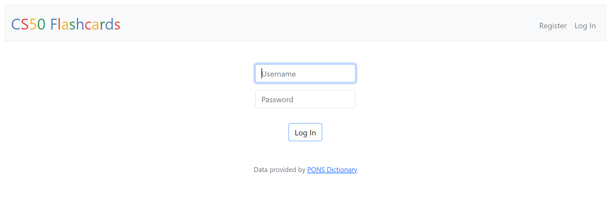
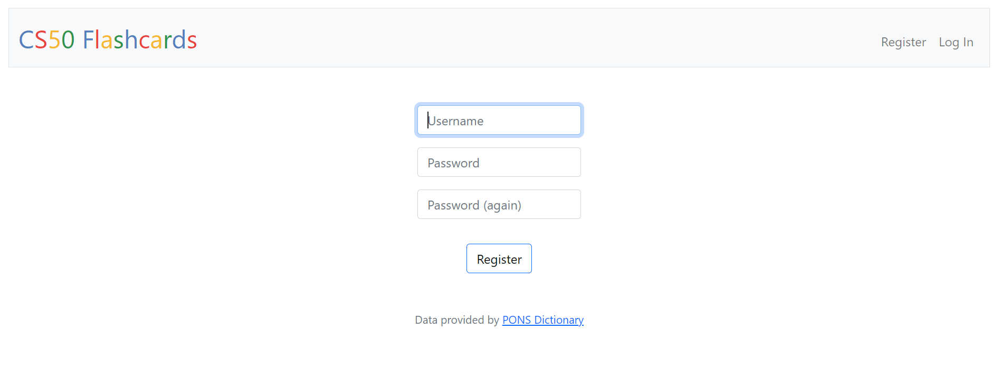
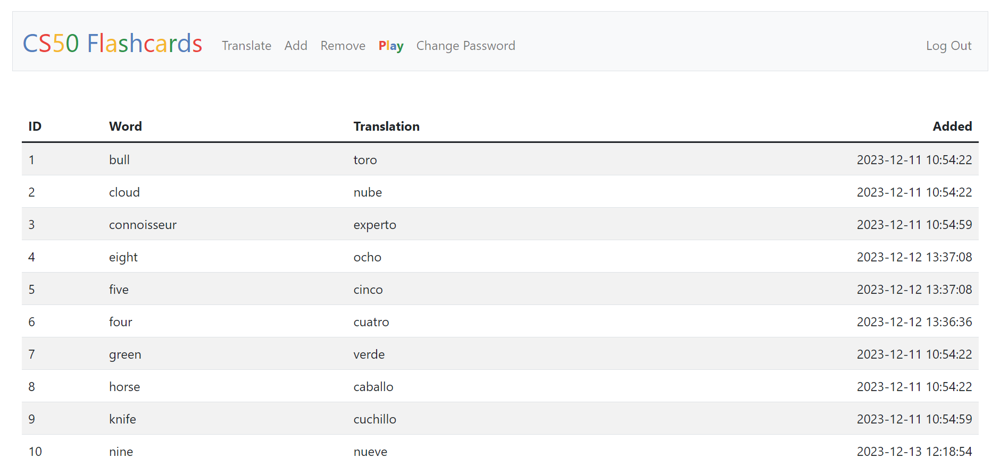
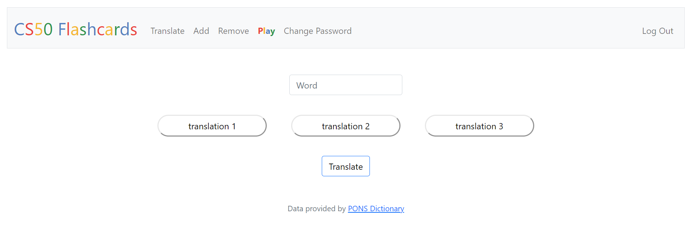
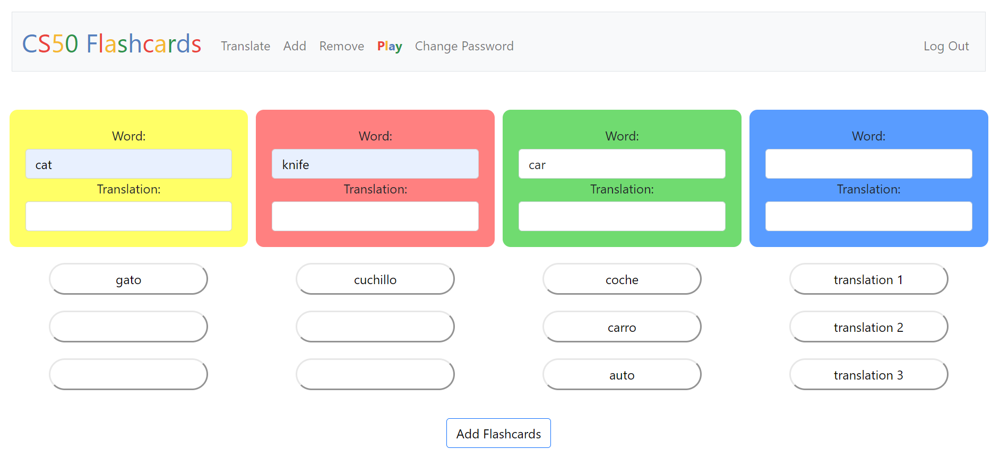
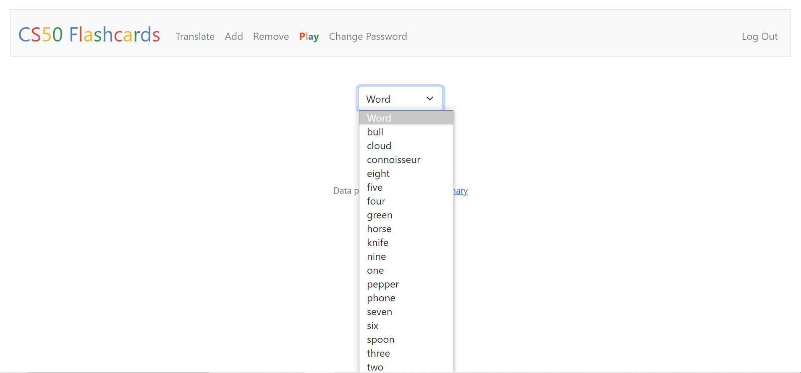
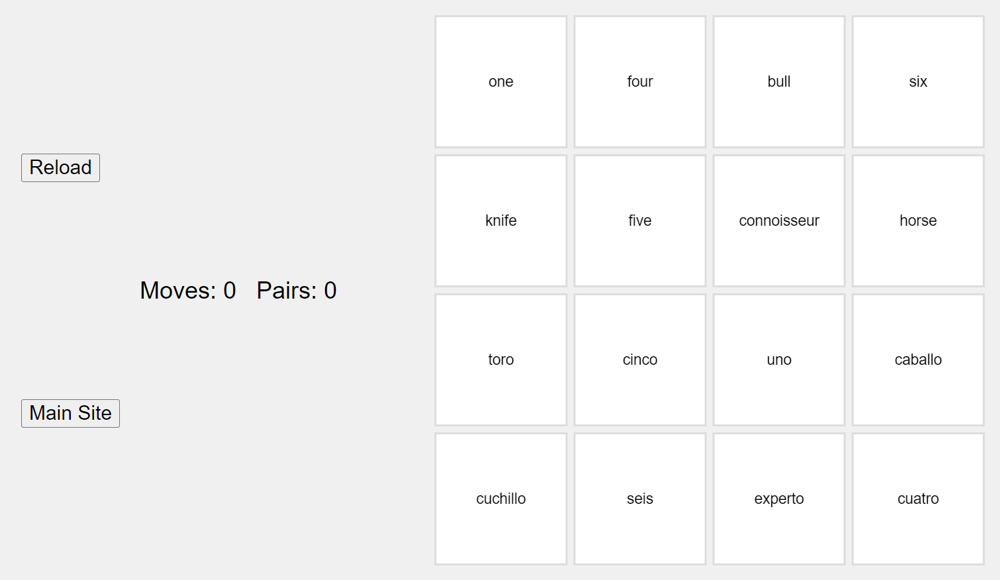
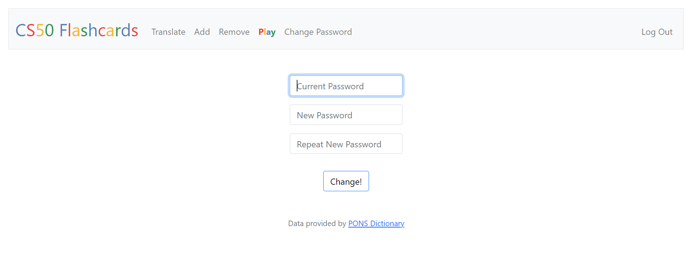

# CS50 Flashcards
#### Video Demo:  https://youtu.be/jsNp7Gd5EI4
#### Description:
CS50 Flashcards is an web app via which you can learn Spanish by being able to translating words and adding them as flashcards. There's an additional functionality that allows user to play a mini game by matching an English word with its Spanish equivalent. This is possible by using API that lets the app download some data (in this case from PONS) by using URL.

#### Index

#### Log in

When accesing the *Index* route an image like the one above should appear. It asks the user to log in by passing username, password and clicking **Log In**. If the user doesn't have an account yet, the only way is to click the **Register** button in the right upper corner.

If **Log In** has been clicked the app will check if there's user with give username in the database and if the hash of given password matchest the hash of password in the database.

#### Register

When accesing the *Register* route an image like the one above should appear. It asks the user to register by passing an unique username, password twice and clicking **Register**. If the user already has an account, the only way is to click the **Log In** button in the right upper corner.

If **Register** has been clicked the app will check for several things:
- if all three input fields are filled in
- is first password matches the second one
- if an unique username has been typed

If all went well, the username will be added to the database as well as the hash of password. Each new user has a credit of 500 flashcards, which can be deleted if needed.

#### Homepage

When accesing the *Homepage* either as a default route after logging in or by clicking in the **CS50 Flashcards** colorful logo an image like the one above should appear. The first thing that stands out is a top panel with several options like:
**CS50 Flashcards**, **Translate**, **Add**, **Remove**, **Play**, **Change Password**. It is possible to sisplay because a unique session has been started after logging in. Below that there're 4 colums that contain id, word, translation and time respectively. In the code all the words with its translations and timestamps that suit the unique user are selected from the database and then displayed alphabetically.

#### Translate

Rendering *Translate* template results in displaying an input field, three buttons with translations and a **Translate** button - as per the image above. User is asked to type word in English and after clicking the **Translate** button first three translations of the word are displayed in the three buttons. In case there's only one, it's displayed in the first button and the other two become blank. Unther the hood there's a JS function that runs when the **Translate** button is clicked. It passes the word from input valu to "/process" route which runs translate function which uses an API to retrieve data from PONS. Once it's successful translate function returns a list of translations. Then the JS function divides it into three words, which are later visible as the text in the buttons.

#### Add

Rendering *Add* template results in displaying four colorful divs with two input fields each. The top one is the English word, the bottom one is Spanish translation. Below each div ther're 3 buttons with Spanish translation of the English word above. At the bottom t there's a **Add Flashcards** button. Before adding the flashcards the app check if at least one word with its translation has been added and if so it adds the flashcard to the database.

Inside the div in the word input field there's a JS event listner that listens for every key up and passes the word to "/process" route which runs translate function which uses an API to retrieve data from PONS. Once it's successful translate function returns a list of translations. Then the JS function divides it into three words, which are later visible as the text in the buttons. If one of the translations suits the user it can be clicked and it will be immediately transfered to the translation inside div. User can also edit the translation before addinf the flashcard.

#### Remove

 Rendering *Remove* template results in displaying a select field where the user can scroll through a drop-down list of previusly added words to the database. The words will be displayed alphabetically. Below there's a button which after clicking will delete the selected word from the database.

 #### Play

 

 Rendering *Play* template results in displaying a 4x4 board like the one above (on condition that the user added at least 8 Flashcards). There're two additional buttons, **Reload** will reload the *Play* template as well as display new random set of 8 Flashcards. After clicking on **Main Site** button user will be redirected to *Index* route.

 The logic in the game is to click on one Spanish word and then on the other  one which is translation of the first on in English. If thre's a match, Pairs and Moves counter wil be incremented by one. Otherwise only Moves counter will be incremented. Once the user suceeds in matching all the pairs a message from the browser will appear: 'Congratulations! You've matched all pairs!'. After clicking 'OK' the flashcards will be replaced by a new set of randomly chosen word pairs.

 #### Change Password

 

 Rendering *Change* template results in displaying an image like the one above. It asks the user to change password by passing current password, new one, its confirmation and clicking **Change!**.

If **Change!** has been clicked the app will check for several things:
- if all three input fields are filled in
- is hash of current password matches the hash in the database
- if a new one matches the one in confirmation field

If all went well, the user password will be changed.